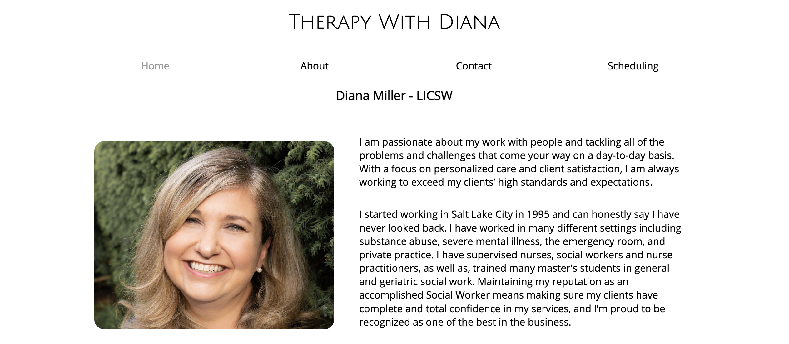

# Therapy With Diana - Mental Health Private Practice Website

## Introduction

Welcome to the official repository for the **Therapy With Diana** website - a platform designed to provide valuable information about mental health and offer insights into the services provided by Diana Miller LICSW, an experienced mental health practitioner.

## Contact Information

- **Author:** Drew King (they/them)
- **Email:** [kingdrew@uw.edu](mailto:kingdrew@uw.edu)

## About the Website

The **Therapy With Diana** website is a testament to the integration of custom HTML and CSS to create an inviting and informative online space for individuals seeking mental health services. As the focal point of Diana's private practice, the website aims to provide visitors with a clear understanding of Diana's approach, services, and expertise in the field of mental health.

Visit the live website: [therapywithdiana.com](https://www.therapywithdiana.com)

## Development Background

This website was conceived as a final project for a web design class undertaken at Seattle Central College in June 2020. Drawing upon the principles and techniques learned during the course, the author embarked on crafting a visually appealing and user-friendly online platform that could effectively communicate Diana's dedication to mental health care.

Since then, the website has undergone several updates and improvements, including accessibility enhancements to the contact form and navigation, as well as security enhancements to prevent XSS attacks by filtering user input in the contact form.

## Key Features

- **Responsive Design:** The website seamlessly adapts to various screen sizes, ensuring optimal user experience across devices ranging from smartphones to desktop computers.

- **Informative Pages:** Gain insights into Diana's therapeutic approach, specialization areas, and the benefits of seeking professional mental health guidance.

- **Accessibility First:** All pages are well laid out with Responsive Design and include proper roles for elements. This means that the website will work with most accessibility technologies.

- **Contact Information:** Connect with Diana through provided contact details, making it easy to initiate a conversation about the services offered.

## Technologies Used

- **HTML:** The foundation of the website's structure and content.

- **CSS:** Custom styling to create an inviting and visually consistent layout.

- **PHP:** Allowing people to send a message directly through the contact page.

- **JavaScript:** Improved mobile layout and navigation, accessibility enhancements to contact form.

## Contributions and Maintenance

The website has been meticulously maintained and updated by the author since its inception. Contributions, suggestions, and bug reports are welcome and can be submitted through the GitHub repository's issue tracker.

Your engagement helps the author improve and refine the website's features, ensuring that **Therapy With Diana** remains a valuable resource for anyone seeking mental health services.

Thank you for visiting my repository and exploring the world of mental well-being with us.
